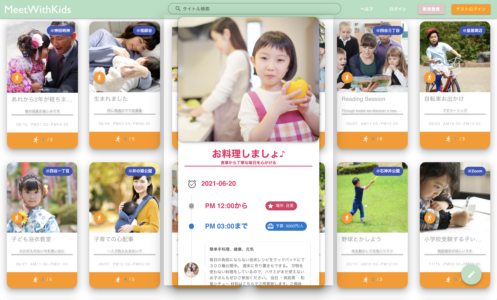
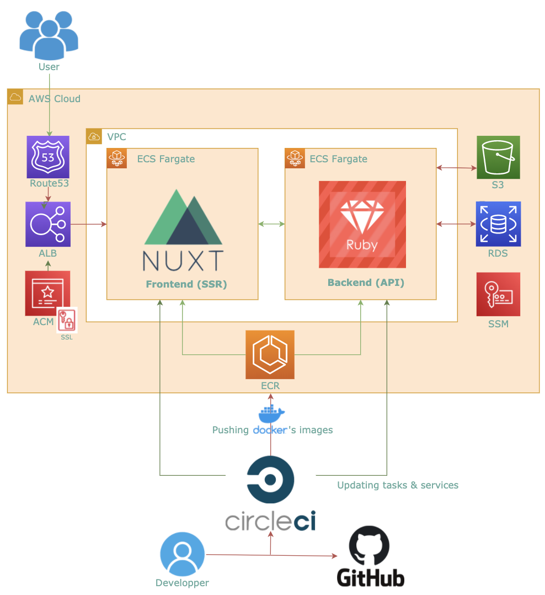
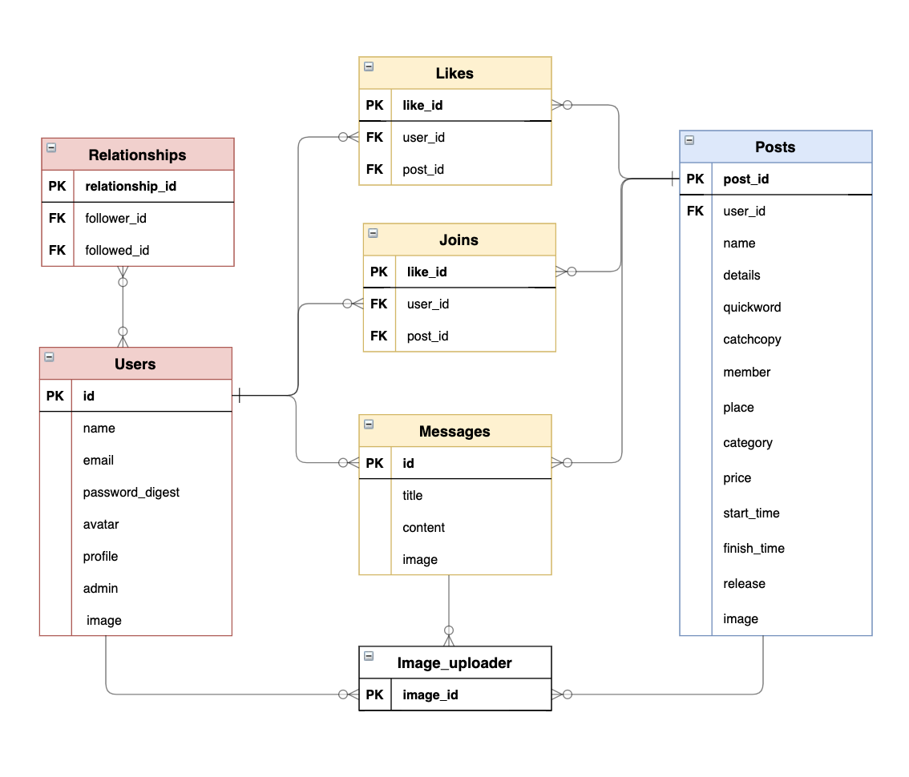

# Meetwithkids

## TOP ( https://meetwithkids )

 

 

## AWS構成図
 

 

## 使用した技術
| フロントエンド  | バックエンド  | インフラ |
| :--- | :--- | :--- |
| HTML / CSS / JavaScript | Ruby 2.7.1 | Docker |
| Nuxt.js + Vuetify | Rails 6.0.3 | CircleCI |
| Jest / ESLint / Prettier | RSpec / Rubocop | AWS / Terraform |
※ Rails は APIモード。Nuxt は SPAモード。

## AWS構成図
 

 

## ER図
 

 

## 特にご覧になってほしい点、および技術の選定理由
* Dockerコンテナのデプロイを ECS (Fargate) 上で実現させている点。 
  * 目的：サーバレスの本番環境によるセキュリティ向上のため

* テストツールとコード解析ツールのチェックをパスしている点。 
  * フロントエンド側　……   JEST/ESLint/Prettier
  * バックエンド 側　……  　Rubocop/RSpec
  * 目的：可読性向上と早期エラー発見により開発速度を向上するため

* CircleCIで以上２点のパイプラインを構築して自動化させている点。
  * 目的：開発サイドの手間を減らし、ユーザビリティ向上の実現リソースを増やすため）

* Nuxt.js (SPAモード) と Rails (APIモード) により、ビューを高速化している点。 
  * 目的：普段忙しい親御さんのユーザビリティを向上させるため

* AWS を Terraform で完全コード化して、インフラを管理している点。 
  * 目的：サービス利用者にとって望ましいスケールに柔軟に対応するため

## 【機能一覧】
| 基本機能 |
| :--- |

* ユーザ登録
* ユーザ削除
* ユーザ情報変更 
( アバター、ユーザネーム、パスワード、メールアドレス )
* ユーザーマイページ表示 
( お気に入り・参加・メッセージ・フォロー・フォロワー )

* ログイン（ゲストログインを含む）
* フォロー
  

| ■ 投稿に関する機能 |
| :--- |
* CRUD (生成/読取/更新/削除) 
* ❤️ (お気に入り) 
 * 🏃‍♀️ (参加) 
 * 検索 
 * 参加者一覧 
  

|メッセージに関する機能|
| :--- |
* CRUD (生成/読取/更新/削除) 
* 画像添付
* 画像プレビュー 
  

| 管理者機能 |
| :--- |
* 全てのユーザーそれぞれに対する「削除」 
* 全ての投稿それぞれに対する「削除 / 編集」 
* 全てのメッセージそれぞれに対する「削除」 

