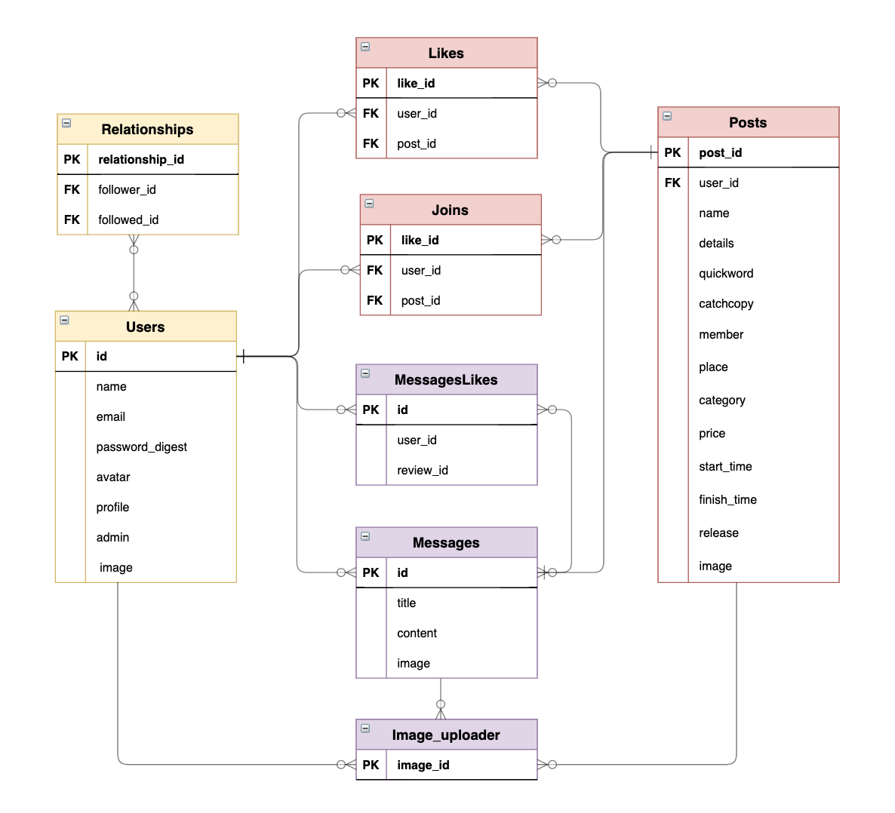
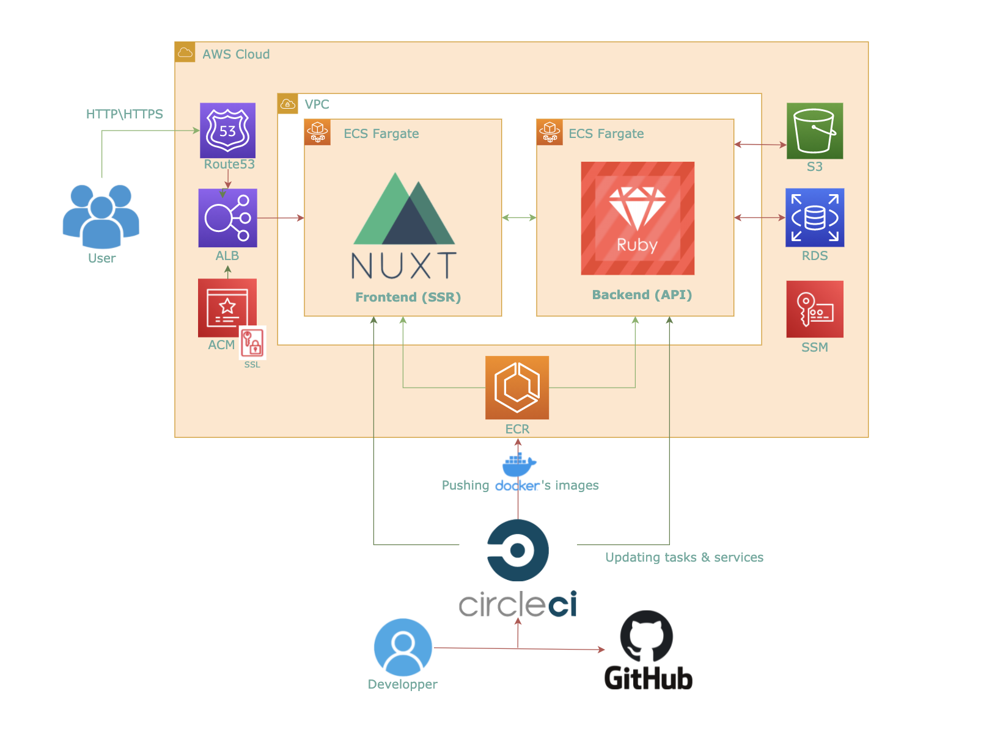

# Meetwithkids

#### トップページ

## 特に見ていただきたい点
・Dockerコンテナのデプロイを ECS (Fargate) 上で実現させている点。
　　（目的：サーバレスの本番環境によるセキュリティ向上のため）

・テストツールとコード解析ツールのチェックをパスしている点。
　　　フロントエンド側　……   JEST/ESLint/Prettier
　　　バックエンド 側　……  　Rubocop/RSpec 
　　（目的：可読性向上と早期エラー発見により開発速度を向上するため）

・CircleCIで以上２点のパイプラインを構築して自動化させている点。
	（目的：開発サイドの手間を減らし、ユーザビリティ向上の実現リソースを増やすため）

・Nuxt.js (SPAモード) と Rails (APIモード) により、ビューを高速化している点。
	（目的：普段忙しい親御さんのユーザビリティを向上させるため）

・AWS を Terraform で完全コード化して、インフラを管理している点。
　（目的：サービス利用者にとって望ましいスケールに柔軟に対応するため）

## 使用した技術
* フロントエンド  
  * HTML/CSS
  * Javascript
  * Nuxt.js（SPAモード）
  * Vuetify（UIフレームワーク）
  * Jest（テスト）
  * ESLint/Prettier（コード解析ツール）
* バックエンド  
  * Ruby 2.7.1
  * Ruby on Rails 6.0.3 （APIモード）
  * Rubocop（コード解析ツール）
  * RSpec（テスト）
* インフラ・開発環境  
  * Docker/Docker-compose
  * AWS（ECR,ECS,VPC,S3,Route53,ALB,RDS,ACM,SSM）
  * Terraform（インフラのコード管理）
  * CircleCI（CI/CD）

## ER図
 

## AWS構成図
 

 

## 機能一覧
* 基本機能
  * 新規会員登録・ログイン機能
  * 検索機能
  * ポスト詳細情報閲覧
  * ユーザーマイページ表示（ポストいいね・フォロー・フォロワー表示）
  * ポストメッセージ閲覧
* ログイン後機能
  * メッセージ投稿・編集・削除
  * ユーザーフォロー機能
  * ユーザー登録情報変更（アイコン画像・プロフィール・メールアドレス・パスワード）
  * ユーザー削除
* 管理者機能
  * ユーザー・メッセージ削除

