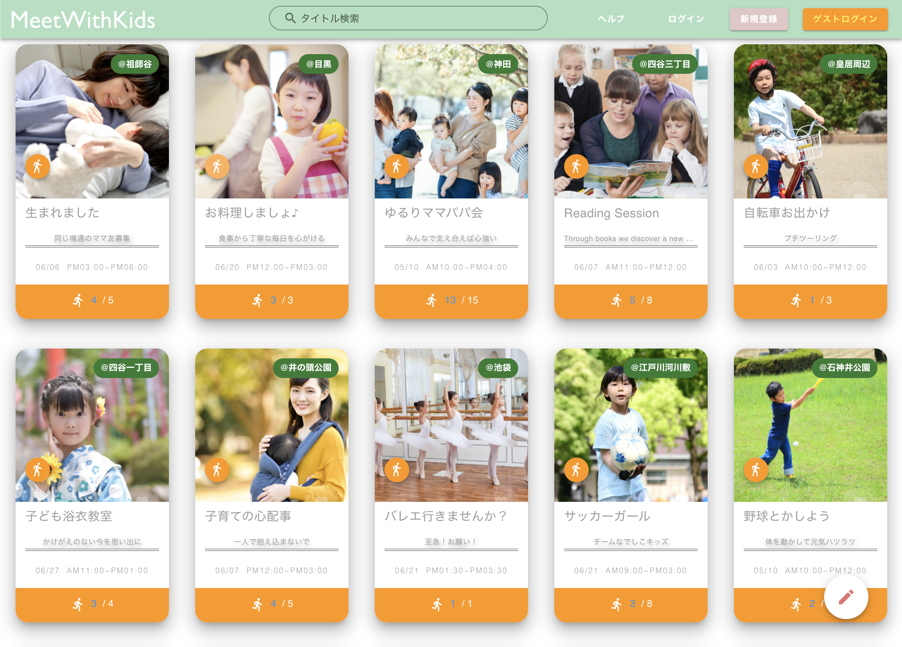
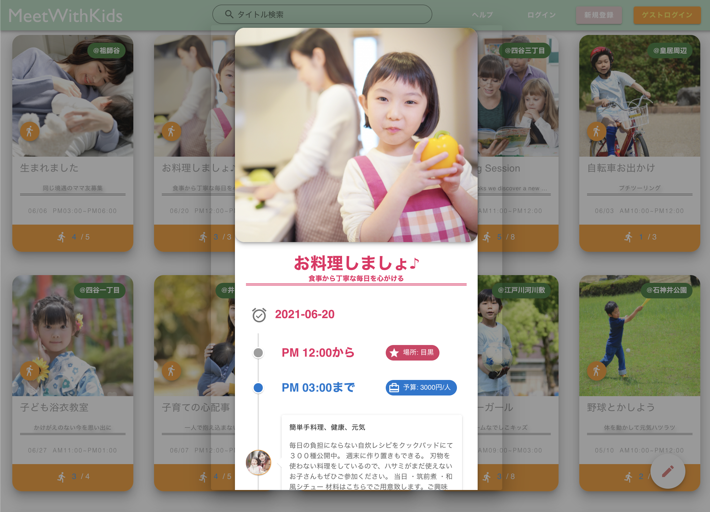
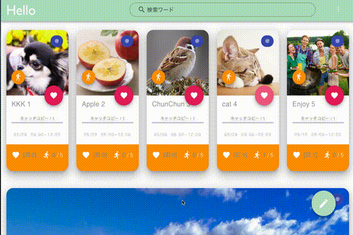

# Meetwithkids
#### リンク：https://meetwithkids.org/

## 概要
ママパパのコミュニティを広げるためのマッチングアプリ。 
子連れで体験する機会を探したり、逆に告知したりすることができる。 
コロナで失われてしまった機会をご家庭に取り戻すことを目指している。 

 

 

## 制作背景
以前勤務した保育園では、異年齢保育（０〜１２歳）が実践されていた。  
利用者の親御さん曰く、幼い頃から幅広い年齢層と関わり合いを持てるようにとの事。好感を持つと同時に、そのような機会が与えられない子どもがいるのではないか？と想像する。  
一方、プライベートでも子育てする機会に恵まれ、子どもの笑顔をそばで見続けた。そうした経験から子どもの体験機会が増えることを望んだ。

## AWS構成図
 

 

## ER図
 

 

## 使用した技術
| フロントエンド  | バックエンド  | インフラ |
| :--- | :--- | :--- |
| HTML / CSS / JavaScript | Ruby 2.7.1 | Docker |
| Nuxt.js + Vuetify | Rails 6.0.3 | CircleCI |
| Jest / ESLint / Prettier | RSpec / Rubocop | AWS / Terraform |

※ Rails は APIモード。Nuxt は SPAモード。

 

## 工夫した点
* <b>UI/UX の点で意識したこと</b>  
・色に「太陽」と「野原」を意識したこと。  
・柔らかい雰囲気になるように、全体的に丸みを帯びさせたこと。  
・50人以上のペルソナを用意して、1人ずつ別々の投稿を考えたこと。  
・参加までの導線を引いて、忙しい親御さんが隙間時間で 
　気軽に利用できるようにしたこと。（開発途中のgif/Twitter参照）

<blockquote class="twitter-tweet">
Rails × Nuxt.js × AWS 85日目  ✏️✏️ UI ブラッシュアップ   SPA化による一連のフローが完成。  ♡（いいね）ボタンでリストインさせ、リストから非同期でページビューさせる。  モダンな Webアプリ😊
<a href="https://twitter.com/hashtag/%E4%BB%8A%E6%97%A5%E3%81%AE%E7%A9%8D%E3%81%BF%E4%B8%8A%E3%81%92?src=hash&amp;ref_src=twsrc%5Etfw">#今日の積み上げ</a> <a href="https://twitter.com/hashtag/%E3%83%97%E3%83%AD%E3%82%B0%E3%83%A9%E3%83%9F%E3%83%B3%E3%82%B0?src=hash&amp;ref_src=twsrc%5Etfw">#プログラミング</a><a href="https://twitter.com/hashtag/%E9%A7%86%E3%81%91%E5%87%BA%E3%81%97%E3%82%A8%E3%83%B3%E3%82%B8%E3%83%8B%E3%82%A2%E3%81%A8%E7%B9%8B%E3%81%8C%E3%82%8A%E3%81%9F%E3%81%84?src=hash&amp;ref_src=twsrc%5Etfw">#駆け出しエンジニアと繋がりたい</a> <a href="https://t.co/MzcMXo54Xg">pic.twitter.com/MzcMXo54Xg</a>
&mdash; Kent@Nuxt×AWSで転活中 (@kent_0n) <a href="https://twitter.com/kent_0n/status/1392081284067778563?ref_src=twsrc%5Etfw">May 11, 2021</a></blockquote>
 
&nbsp;

* <b>全体の構成で意識したこと</b>  
・参加するまでのコンバージョン率を上げるために、ページ遷移を無くして、インデックスページ上で作業を完結できるようにしたこと。また、参加を検討するためにストックするリストを用意したこと。  
・家事・育児・仕事に追われる親御さんに利用してもらえるように、高速なWEBサイトを目指したこと。そのために、Rails (APIモード) と Nuxt.js を掛け合わせて、SPA化で対応したこと。 
&nbsp;

* <b>Devops の点で意識したこと</b>  
・CircleCI で解析ツール（Rubocop/ESLint/Prettier）を通してエラーの早期発見に対応したこと。  
・CircleCI と Fargate を連動させることで、ユーザの声に迅速に対応できるデプロイを可能にしたこと。  
・Terraform を用いて AWS を完全にコード化したことで、柔軟なスケールにも対応できるようにしたこと。 

 

## 【機能一覧】
| 基本機能 |
| :--- |

* ユーザ登録
* ユーザ削除
* ユーザ情報変更 
( アバター、ユーザネーム、パスワード、メールアドレス )
* ユーザーマイページ表示 
( お気に入り・参加・メッセージ・フォロー・フォロワー )

* ログイン（ゲストログインを含む）
* フォロー
  

| ■ 投稿に関する機能 |
| :--- |
* CRUD (生成/読取/更新/削除) 
* ❤️ (お気に入り) 
 * 🏃‍♀️ (参加) 
 * 検索 
 * 参加者一覧 
  

|メッセージに関する機能|
| :--- |
* CRUD (生成/読取/更新/削除) 
* 画像添付
* 画像プレビュー 
  

| 管理者機能 |
| :--- |
* 全てのユーザーそれぞれに対する「削除」 
* 全ての投稿それぞれに対する「削除 / 編集」 
* 全てのメッセージそれぞれに対する「削除」 

